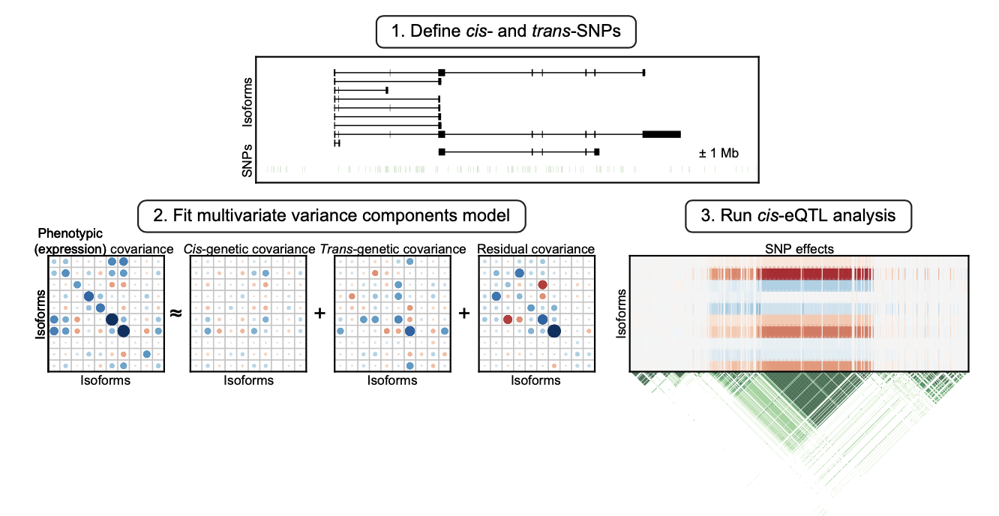
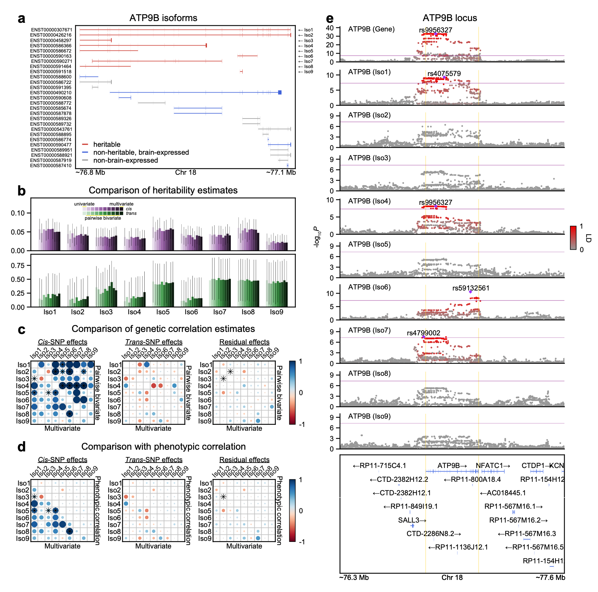
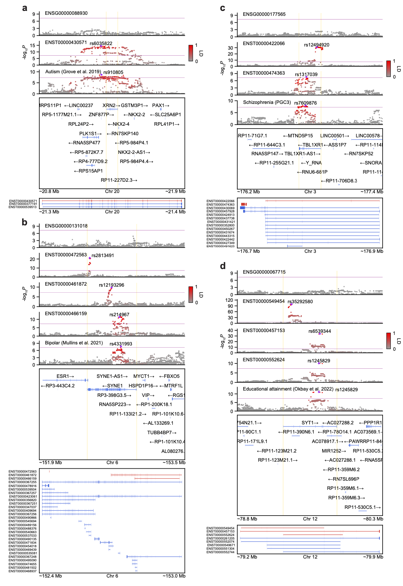
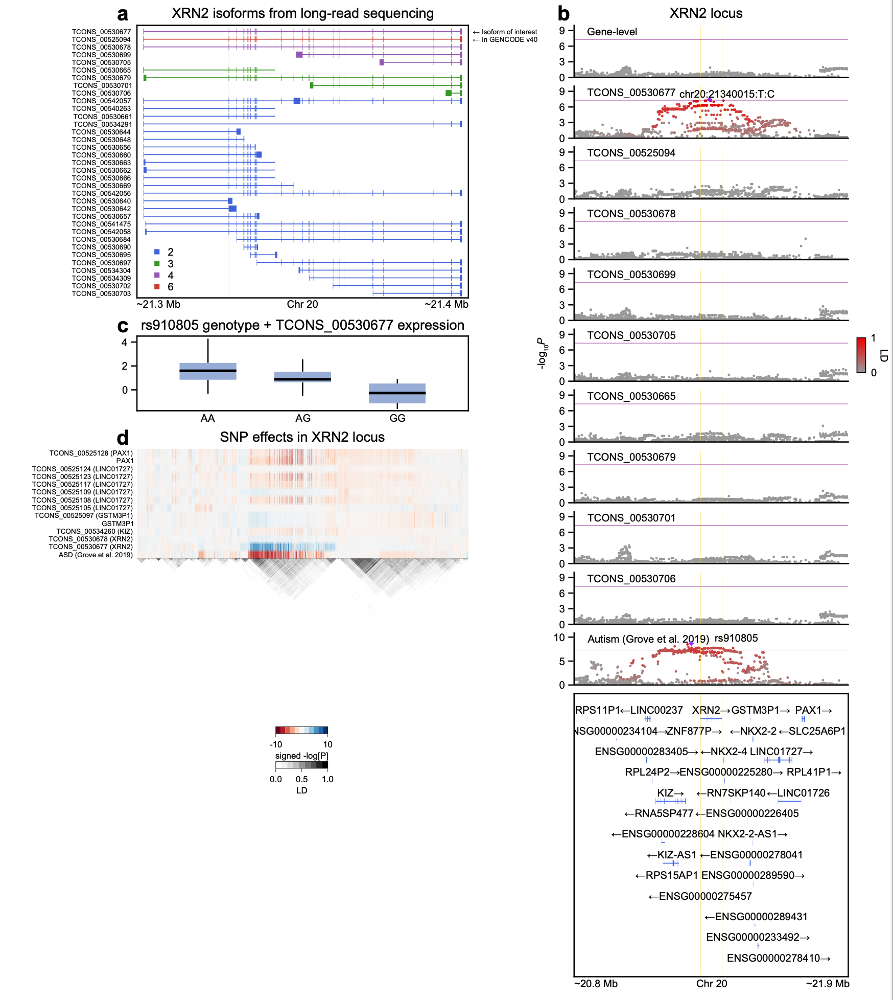

# isoform-genetics

This repository contains code and instructions for heritability and genetic correlation analyses, using the [MultiResponseVarianceComponentModels.jl](https://github.com/Hua-Zhou/MultiResponseVarianceComponentModels.jl) <a href="https://julialang.org"> Julia </a>package and applying it to the PsychENCODE brain expression data. For more details, please take a look at the associated paper [Kim et al. 2022](https://www.medrxiv.org/content/10.1101/2022.10.18.22281204v1). All analyses herein were conducted solely using <a href="https://julialang.org"> Julia</a>. 

## Getting started 
```julia
julia> ]
(@v1.9) pkg> activate .
(isoform-genetics) pkg> instantiate
```
## Required data
    data
    ├── expression
    │   ├── PsychENCODE-EUR-gene.BED.gz                                                 # normalized PsychENCODE gene expression
    │   ├── PsychENCODE-EUR-isoform.BED.gz                                              # normalized PsychENCODE isoform expression
    │   └── PsychENCODE-EUR-covariates.tsv                                              # covariates for mean (or fixed) effects
    ├── genotype
    │   └── Capstone4.HRC.European.unique.frontal.nochr.filter.unrelated.{bed,bim,fam}  # PsychENCODE genotype data
    ├── 1kg
    │   └── kgp.eur.maf0.05.{bed,bim,fam}                                               # 1000 Genomes data subsetted to European individuals
    └── gwas                                                                            # GWAS summary statistics

## Output
<p align="center"></p>

<p align="center"></p>

<p align="center"></p>

<p align="center"></p>

<p align="center"></p>

## References
- M. Kim, D.D. Vo, C.T. Jops, C. Wen, A. Patowary, A. Bhattacharya, C.X. Yap, H. Zhou, and M.J. Gandal: **Multivariate variance components analysis uncovers genetic architecture of brain isoform expression and novel psychiatric disease mechanisms** (2022) ([link](https://www.medrxiv.org/content/10.1101/2022.10.18.22281204v1))