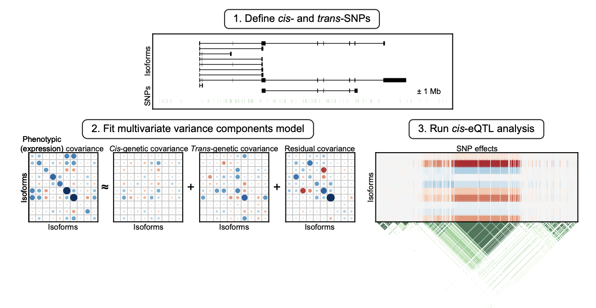
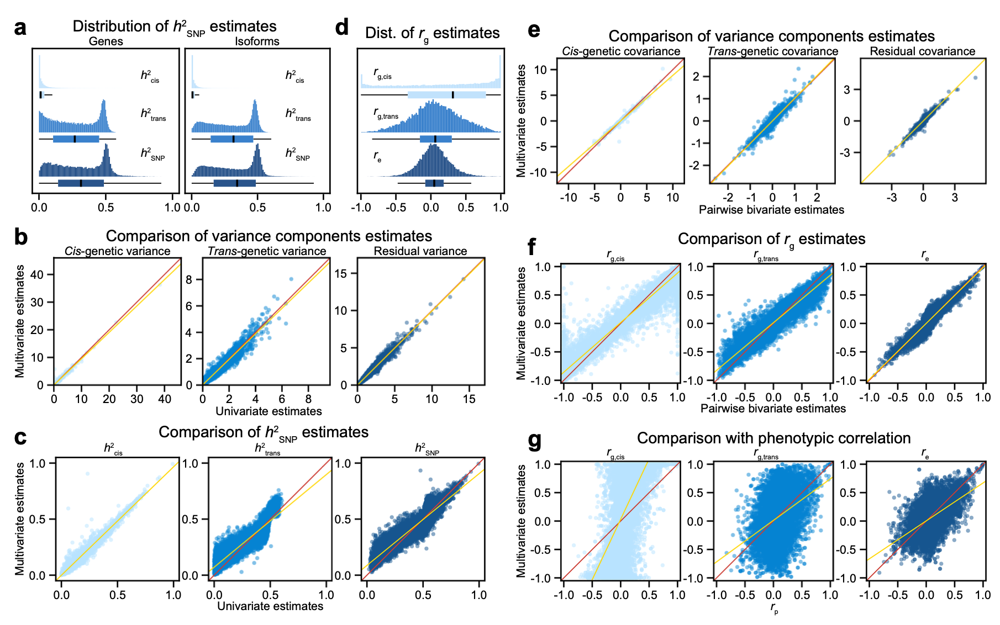
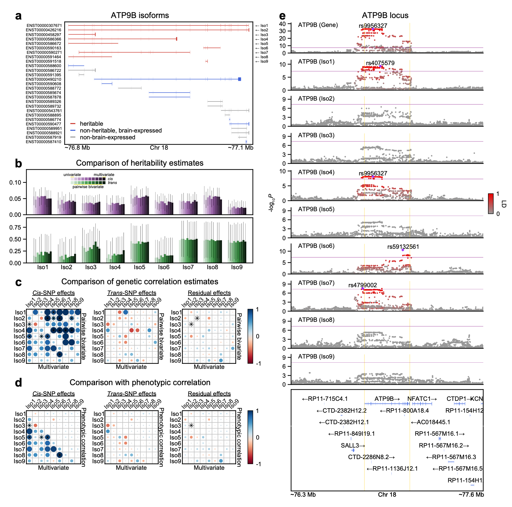
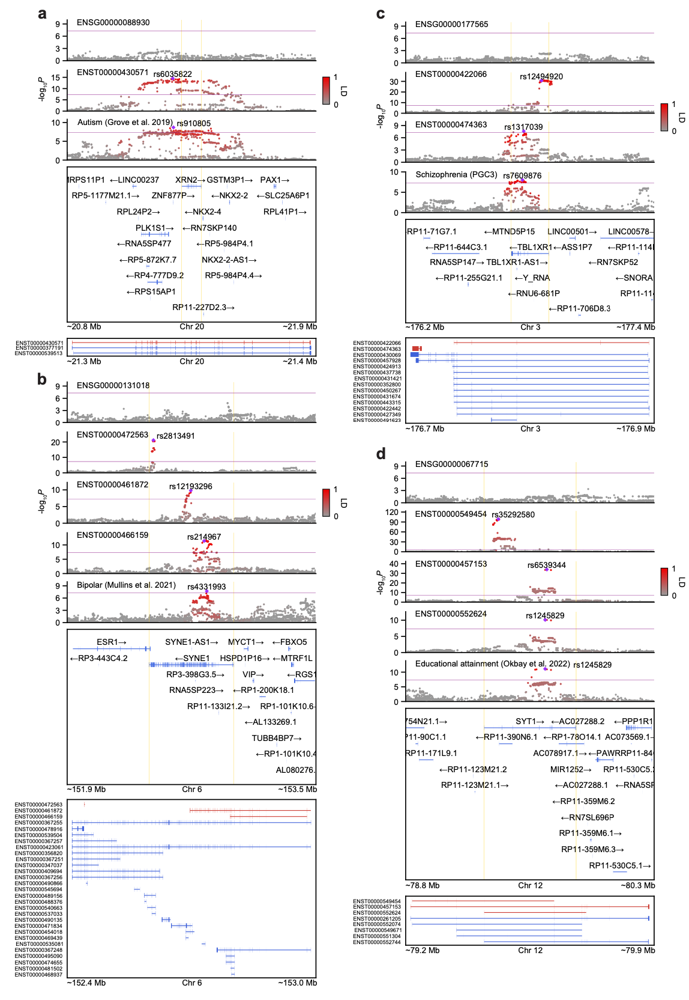
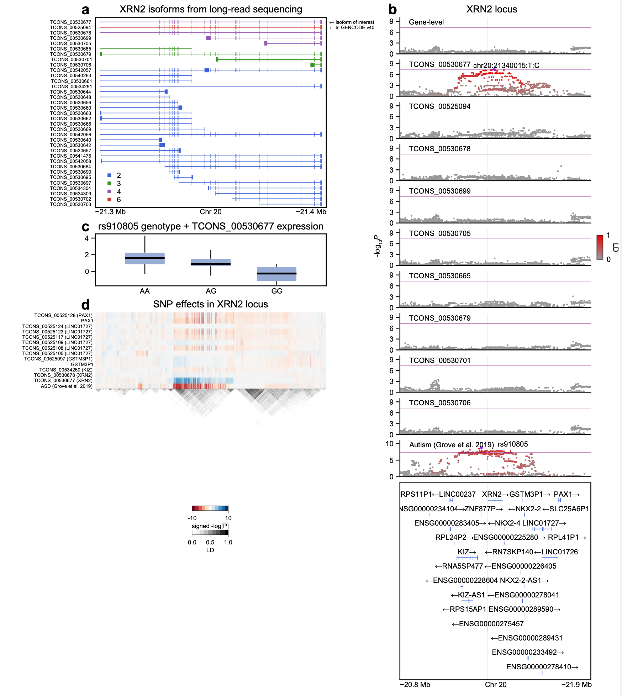

# isoform-genetics

This repository contains code and instructions for heritability and genetic correlation analyses, using the <a href="https://github.com/Hua-Zhou/MultiResponseVarianceComponentModels.jl"> MultiResponseVarianceComponentModels.jl </a> <a href="https://julialang.org"> Julia </a>package and applying it to the [PsychENCODE brain gene and isoform expression data](http://resource.psychencode.org/). There is a great number of primary literature, review papers, and educational materials that explain in broad strokes the heuristics of heritability and genetic correlation analyses. If you are interested more in technical details with clarity of presentation and mathematical notation, please take a look at the **Methods** section of the associated paper [Kim et al. 2022](#references). All analyses herein were conducted solely using <a href="https://julialang.org"> Julia</a>. If you have any questions, also let me know via my email minsookim@mednet.ucla.edu.

## Getting started
[To install necessary packages and activate a separate environment](https://pkgdocs.julialang.org/v1/environments/#Using-someone-else's-project), open <a href="https://julialang.org"> Julia</a> within the directory and type:
```julia
julia> ]
(@v1.7) pkg> activate .
(isoform-genetics) pkg> instantiate
```
## Required data
Some data like [GENCODE](https://www.gencodegenes.org/human/) is automatically downloaded when it is missing, whereas other data like the ones below are not publicly available and need to be made available before running any <a href="https://julialang.org"> Julia </a>code.

    data
    ├── expression
    │   ├── PsychENCODE-EUR-gene.BED.gz                                                 # normalized PsychENCODE gene expression
    │   ├── PsychENCODE-EUR-isoform.BED.gz                                              # normalized PsychENCODE isoform expression
    │   └── PsychENCODE-EUR-covariates.tsv                                              # covariates for mean (or fixed) effects
    ├── genotype
    │   └── Capstone4.HRC.European.unique.frontal.nochr.filter.unrelated.{bed,bim,fam}  # PsychENCODE genotype data
    ├── 1kg
    │   └── kgp.eur.maf0.05.{bed,bim,fam}                                               # 1000 Genomes data subsetted to European individuals
    └── gwas                                                                            # GWAS summary statistics

**Couple notes:**
- `PsychENCODE-EUR-gene.BED.gz` and `PsychENCODE-EUR-isoform.BED.gz`: [RNA-seq reads were previously aligned](https://www.science.org/doi/10.1126/science.aat8127) to the hg19 reference genome with STAR 2.4.2a and gene and isoform-level quantifications calculated using RSEM v1.2.29. Genes and isoforms were filtered to include those with TPM > 0.1 in at least 25% of samples. Gene and isoform expression were separately normalized using TMM normalization in edgeR and log2-transformed. RNA-seq data was also restricted to frontal cortex samples from European individuals as well as genes and isoforms belonging to autosomal chromosomes, resulting in a total of **24,905 genes and 93,293 isoforms** based on GENCODE v19 annotation.
- `PsychENCODE-EUR-covariates.tsv`: The same set of known biological and technical covariates were used for mean or fixed effects, which include age, age<sup>2</sup>, study, sex, diagnosis, RNA integrity number (RIN), RIN<sup>2</sup>, post-mortem interval (PMI), 24 sequencing principal components (PCs), and 5 genetic PCs.
- `Capstone4.HRC.European.unique.frontal.nochr.filter.unrelated.{bed,bim,fam}`: [Genotype data were previously harmonized](https://www.science.org/doi/10.1126/science.aat8464) through phasing and imputation with the Haplotype Reference Consortium (HRC) reference panel. We focused on 860 unique European individuals with matching genotype and frontal cortex RNA-seq data. We started with 5,312,508 HRC imputed SNPs and filtered for SNPs with minor allele frequency (MAF) > 0.01, genotype and individual missingness rate < 0.05, and Hardy-Weinberg equilibrium (HWE) *P* values > 10<sup>-6</sup>. Five pairs of individuals had classic genetic relationship matrix (GRM) values > 0.05 when using all filtered SNPs, while 647 pairs of individuals had GRM values > 0.025. We kept one individual from each of five pairs and only SNPs belonging to autosomal chromosomes, resulting in a total of **855 unrelated European individuals and 4,685,674 SNPs** for downstream analyses.
- `kgp.eur.maf0.05.{bed,bim,fam}`: Example linkage disequilibrium (LD) reference panel based on individuals of European ancestry in the [1000 Genomes Project](https://www.internationalgenome.org/) was generated using https://github.com/mmkim1210/1kg. This data is only used for visualization purpose, and not for actual variance components analysis.
- `gwas`: [Multiple GWAS summary statistics](https://github.com/mmkim1210/GeneticsMakie.jl/blob/master/src/gwas.jl) were previously downloaded and harmonized using `mungesumstats!` function of the [GeneticsMakie.jl](https://github.com/mmkim1210/GeneticsMakie.jl) <a href="https://julialang.org"> Julia </a>package. This data is not required for variance components analysis.

## Variance components analysis
```bash
qsub ./submit.sh
```

## Figures
Once the results are parsed, **Figures 1-5** in [Kim et al. 2022](#references) can be reproduced by running `./src/fig{1,2,3,4,5}.jl`, respectively. Minor edits can then be made using `Illustrator` to finalize the figures as follows.

**Figure 1:**
<p align="center"></p>

**Figure 2:**
<p align="center"></p>

**Figure 3:**
<p align="center"></p>

**Figure 4:**
<p align="center"></p>

**Figure 5:**
<p align="center"></p>

<a name="references"/>

## References
- M. Kim, D.D. Vo, C.T. Jops, C. Wen, A. Patowary, A. Bhattacharya, C.X. Yap, H. Zhou, and M.J. Gandal: **Multivariate variance components analysis uncovers genetic architecture of brain isoform expression and novel psychiatric disease mechanisms** (2022) ([link](https://www.medrxiv.org/content/10.1101/2022.10.18.22281204v1))